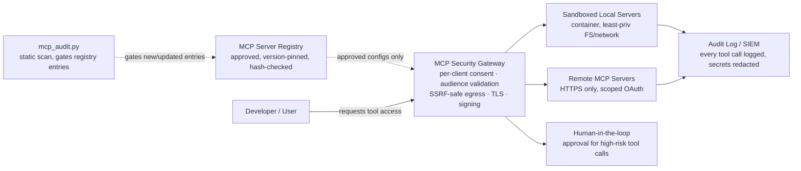

# Securing MCP Deployments with the NIST AI Risk Management Framework

## Purpose

The Model Context Protocol (MCP) lets AI models discover and invoke tools exposed by external servers — file systems, databases, SaaS APIs, internal services. That flexibility is also what makes it a genuinely new attack surface: a tool's *description* can carry instructions the model treats as trustworthy, a server can be swapped out after approval, and a proxy sitting between client and third-party API can be turned into a confused deputy. None of this is theoretical — it's documented in MCP's own security specification and in independent research from OWASP and application security vendors (see [References](#references)).

This document maps MCP-specific risks to the four functions of the [NIST AI Risk Management Framework (AI RMF 1.0)](https://www.nist.gov/itl/ai-risk-management-framework) — Govern, Map, Measure, Manage — so that securing an MCP deployment is treated as a governed, repeatable process rather than a one-time checklist. It's paired with a working tool (`tool/mcp_audit.py`) that statically scans MCP server configurations and tool manifests for a subset of these risks, and a reference architecture for deploying MCP servers defensibly.

## MCP threat model summary

| Risk | Description | Primary source |
|---|---|---|
| Tool poisoning | Malicious instructions hidden in a tool's description, parameter names, or schema — an "invisible exploit surface" the model reads but a human reviewer may not scrutinize | OWASP MCP Cheat Sheet, Checkmarx |
| Rug pulls / supply chain | A previously reviewed server or tool definition changes after approval (version bump, compromised dependency, malicious maintainer) | MCP Security Best Practices, Checkmarx |
| Confused deputy | An MCP proxy server with a static client ID and no per-client consent can be tricked into handing an attacker a valid authorization code | MCP Security Best Practices |
| Token passthrough | A server accepts and forwards tokens not issued for it, breaking the audience boundary and enabling cross-service replay | MCP Security Best Practices |
| SSRF via metadata discovery | A malicious server points OAuth metadata URLs at internal IPs or cloud metadata endpoints, and a client that doesn't validate follows them | MCP Security Best Practices |
| State handle hijacking | An attacker guesses or obtains a state handle (cart ID, workflow ID) and uses it to access another user's session, because the server never bound it to an authenticated identity | MCP Security Best Practices |
| Local server compromise | A locally-run server (or its startup command) executes with the full privileges of the user who approved it — no sandboxing, no visibility into what it actually runs | MCP Security Best Practices |
| Excessive scope / permission | Servers request (and clients grant) broad, omnibus scopes instead of the minimum needed, expanding blast radius if a token leaks | MCP Security Best Practices, Checkmarx |
| Tool shadowing / typosquatting | A malicious tool is named to closely resemble an already-trusted one, so the model (or a distracted reviewer) invokes the wrong one | Checkmarx |
| Credential exposure | Secrets embedded directly in server configuration files, logs, or tool outputs rather than a secrets manager | OWASP MCP Cheat Sheet |
| Indirect prompt injection via tool output | A tool's *return value* — not just its description — carries instructions the model treats as trusted context | OWASP MCP Cheat Sheet, Checkmarx |

## Mapping to the NIST AI RMF

The AI RMF's four functions are designed to be applied iteratively across an AI system's lifecycle, not as a one-time gate. Applied to an MCP deployment specifically:

### GOVERN — policy, accountability, and third-party risk

*What this function covers for MCP:* who is allowed to approve a new MCP server, what evidence that approval requires, and how third-party/supply-chain risk from externally maintained servers is owned.

| MCP control | What it addresses |
|---|---|
| A maintained registry of approved servers (source repo, publisher, approving reviewer, approval date, pinned version/hash) | Without this, "is this server approved?" has no authoritative answer — the runtime config file becomes the de facto (and unaudited) system of record |
| A documented policy for what categories of tool require human-in-the-loop approval at call time (destructive filesystem ops, financial transactions, sending communications) vs. what can run autonomously | Prevents ad hoc, inconsistent trust decisions made in the moment by whichever engineer is looking at it |
| A named owner for third-party MCP server risk, mirroring how the org already owns third-party library/dependency risk | Closes the gap where "it's just an MCP server" gets less scrutiny than a library with the same level of code execution capability |

This repo's tool enforces a piece of this mechanically: rule `GOV-001` flags any server entry with no recorded source/publisher metadata, so an ungoverned addition is caught in CI rather than discovered later.

### MAP — context, categorization, and third-party risk identification

*What this function covers for MCP:* understanding what each connected server can actually do, categorizing it by the sensitivity of what it touches, and identifying risk in components you didn't write.

| MCP control | What it addresses |
|---|---|
| Categorize each server by blast radius (read-only/local, read-only/network, write/local, write/network, financial/irreversible) before approval | A "read a file" tool and a "send a wire transfer" tool should never go through the same approval bar |
| Review tool descriptions and schemas for embedded instructions before first approval, and re-review on every version change | Directly addresses tool poisoning and rug-pull risk — the review has to happen at the point of change, not just once |
| Pin exact versions for locally-invoked packages (`npx package@1.4.2`, not `npx package`) | Removes the silent "the code that runs today differs from what was reviewed" gap that makes rug pulls possible |
| Check new tool names against the set of already-trusted tool names for suspicious similarity | Catches typosquatting/shadowing before the tool is ever invoked |

This repo's tool implements this directly: `SUPPLY-001` flags unpinned package versions, `POISON-001` flags tool descriptions matching known prompt-injection patterns, and `SHADOW-001`/`SHADOW-002` flag name collisions and typosquat-level similarity.

### MEASURE — evaluation against trustworthy characteristics

*What this function covers for MCP:* testing, before and after deployment, whether the technical controls that are supposed to be in place actually are — not just documented as policy.

| MCP control | What it addresses |
|---|---|
| Verify `additionalProperties: false` is set on tool input schemas | An unrestricted schema accepts arbitrary extra fields, widening what a compromised or malicious client can smuggle through |
| Verify remote transports use HTTPS, never plaintext HTTP to a non-loopback host | Directly mitigates credential/payload interception and is a named MCP anti-pattern in the official spec |
| Test that a server actually rejects tokens not issued for it (no token passthrough) | Confirms the audience-validation boundary is implemented, not just intended |
| Run static analysis against every server config and tool manifest before it's approved, and again on every update | Turns "we reviewed it once" into a repeatable, CI-enforced check |

This repo's tool is itself a MEASURE-function artifact: `EXEC-001` flags dangerous command patterns (`sudo`, `rm -rf`, `curl | sh`) in local server launch configs, and `SCHEMA-001` flags permissive tool schemas — both are automatable trustworthiness tests, not one-time manual reviews.

### MANAGE — risk treatment, prioritization, and monitoring

*What this function covers for MCP:* what happens after a risk is identified — how it's prioritized, mitigated, and tracked over the system's operational life, plus ongoing monitoring for drift.

| MCP control | What it addresses |
|---|---|
| Secrets management: no credentials in plaintext config files, ever | Directly closes the most common and most damaging real-world finding in any credential audit — MCP configs are not a special exception |
| Centralized audit logging of every tool invocation (parameters, calling identity, timestamp), feeding a SIEM with anomaly alerting | Without this, a compromised or malicious tool call is indistinguishable from a legitimate one after the fact |
| A fail-closed default: block on high-severity findings in CI rather than warn-and-continue | Prioritization only means something if it's actually enforced — a policy that never blocks anything isn't risk treatment |
| Periodic re-scan of already-approved servers, not just new ones | Servers can be compromised or updated maliciously after initial approval — Manage is explicitly about the ongoing lifecycle, not a single gate |

This repo's tool implements the enforcement half of this directly: `CRED-001` flags likely hardcoded secrets in server environment configuration, and the CLI exits non-zero on any finding at or above a configurable severity floor (`--fail-on HIGH` by default), so it can gate a CI pipeline exactly like `tfsec`/`Checkov` gate the Terraform repos in this portfolio.

## Reference architecture

Reading this left to right: nothing reaches the gateway without first passing the static scanner into the registry (Map/Measure enforced before Govern approval means anything). The gateway is the single point that enforces per-client OAuth consent (preventing the confused-deputy pattern), validates token audience (preventing passthrough), and applies SSRF-safe egress rules to any outbound metadata/discovery fetch. Local servers run sandboxed with no default host access; everything — sandboxed or remote — logs to a central audit sink. High-risk tool calls route through a human approval step regardless of which path they came from.

## Practical checklist

See [`checklist/mcp-security-checklist.md`](checklist/mcp-security-checklist.md) for an operational, per-function checklist derived from this mapping.

## Using the audit tool

See the root [README](README.md) for usage. In short: `tool/mcp_audit.py` takes an MCP client config (the `mcpServers` map used by Claude Desktop and similar clients) and/or a tool manifest (a `tools/list`-shaped JSON document), runs the checks summarized in the tables above, and reports findings tagged with the specific NIST AI RMF function and rule ID they correspond to.

## References

- [MCP Security Best Practices — Model Context Protocol](https://modelcontextprotocol.io/docs/tutorials/security/security_best_practices) — official specification-adjacent guidance on confused deputy, token passthrough, SSRF, state handle hijacking, local server compromise, and scope minimization
- [MCP Security Cheat Sheet — OWASP Cheat Sheet Series](https://cheatsheetseries.owasp.org/cheatsheets/MCP_Security_Cheat_Sheet.html) — tool integrity, sandboxing, message integrity, supply chain, input/output validation, and credential management controls
- [11 Emerging AI Security Risks with MCP — Checkmarx](https://checkmarx.com/zero-post/11-emerging-ai-security-risks-with-mcp-model-context-protocol/) — tool poisoning, rug pulls, context poisoning, and tool shadowing/typosquatting
- [NIST AI Risk Management Framework (AI RMF 1.0)](https://www.nist.gov/itl/ai-risk-management-framework) and the [AI RMF Playbook](https://airc.nist.gov/airmf-resources/playbook) — the Govern/Map/Measure/Manage structure this document maps onto
